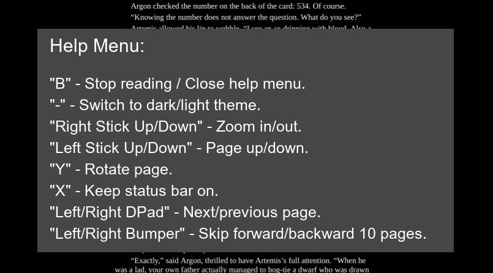
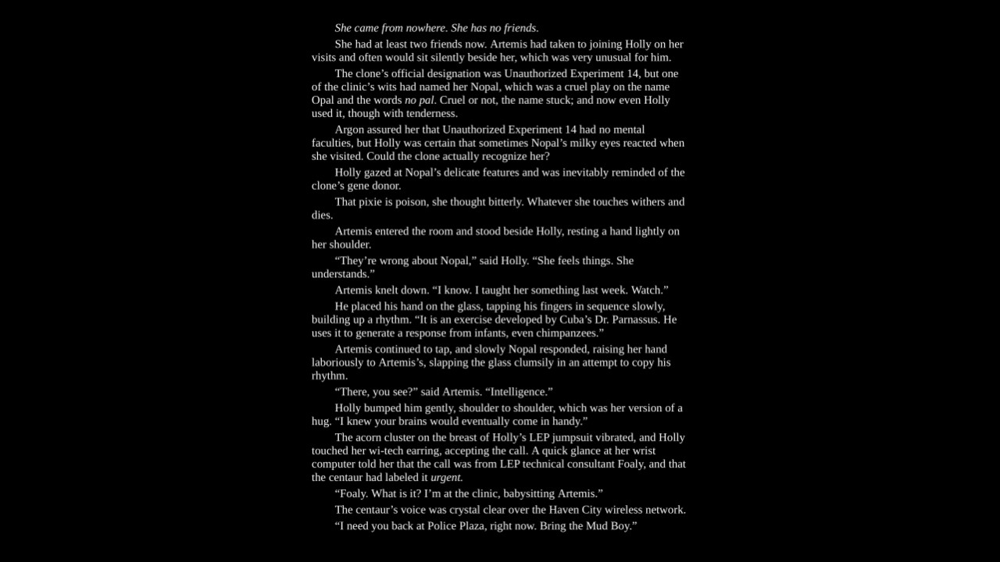
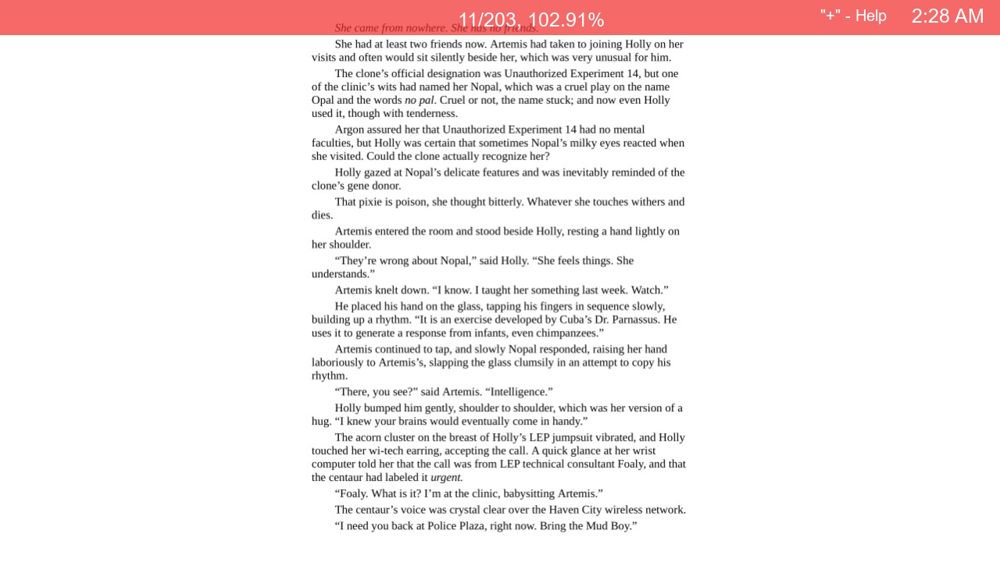

# eBookReaderSwitch

This is a project I've recently just started working on again. Currently its using MuPDF as its backend. Currently only most pdf files work.

### Features:
* Saves last page number
* Reads PDF files
* Dark and light mode
* Landscape reading view
* Portrait reading view

### Current State:
* Most PDF files work, and all epub, cbz and xps files I've tested work.

### TODO:
* Do some extra testing on file compatibility.
* 2 pages side by side in landscape.
* Touch screen for going to next page.
* Hardware lock to prevent accidental touches (maybe Vol- ?) (?).
* Save orientation, and dark mode settings.

### Screen Shots:

Dark Mode Help Menu:
<br></br>

<br></br>

Dark Mode Landscape Reading (With the Switch horizonal):
<br></br>

<br></br>

Dark Mode Portrait Reading (With the Switch vertical):
<br></br>

<br></br>

Dark Mode Book Selection:
<br></br>

<br></br>

Light Mode Landscape Reading:
<br></br>


### Building
* Release built with [libnx release v2.4.0](https://github.com/switchbrew/libnx).
* Uses `freetype` and other libs which comes with `switch-portlibs` via `devkitPro pacman`:
```
pacman -S libnx switch-portlibs
```
then run:
```
make mupdf
make
```
to build.
